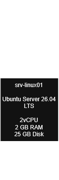

# Arquitectura del Linux Homelab

Este documento describe la arquitectura del laboratorio de infraestructura Linux.

El laboratorio será desarrollado progresivamente, comenzando con una única máquina virtual y evolucionando hacia un entorno con múltiples servidores, redes, servicios, automatización y monitoreo.

---

## 1. Objetivo

El objetivo de la arquitectura es disponer de un entorno controlado donde sea posible practicar:

- Administración de sistemas Linux.
- Networking.
- Seguridad.
- Servicios.
- Automatización.
- Monitoreo.
- Troubleshooting.
- Administración de infraestructura.

La arquitectura debe permitir agregar nuevos componentes sin necesidad de reconstruir completamente el laboratorio.

---

# 2. Arquitectura inicial

La primera versión del laboratorio estará compuesta por una única máquina virtual.

# 3. Maquina virtual inicial

| Parámetro         | Valor                   |
| ----------------- | ----------------------- |
| Hostname          | `srv-linux01`           |
| Sistema operativo | Ubuntu Server 26.04 LTS |
| Arquitectura      | amd64                   |
| Virtualizador     | VirtualBox              |
| CPU               | 2 vCPU                  |
| RAM               | 2 GB                    |
| Disco             | 25 GB                   |
| Red inicial       | NAT                     |
