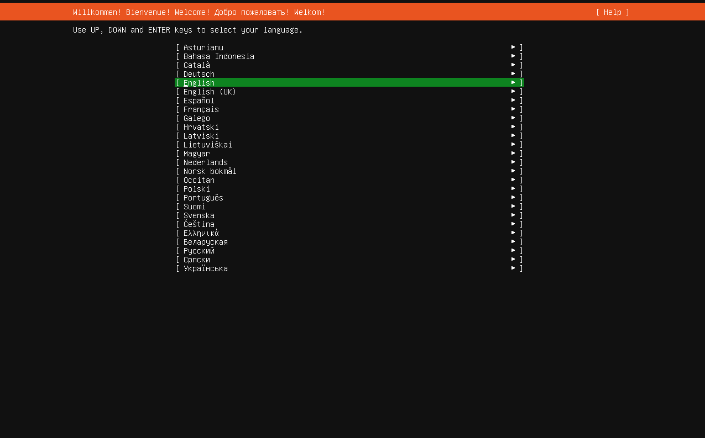
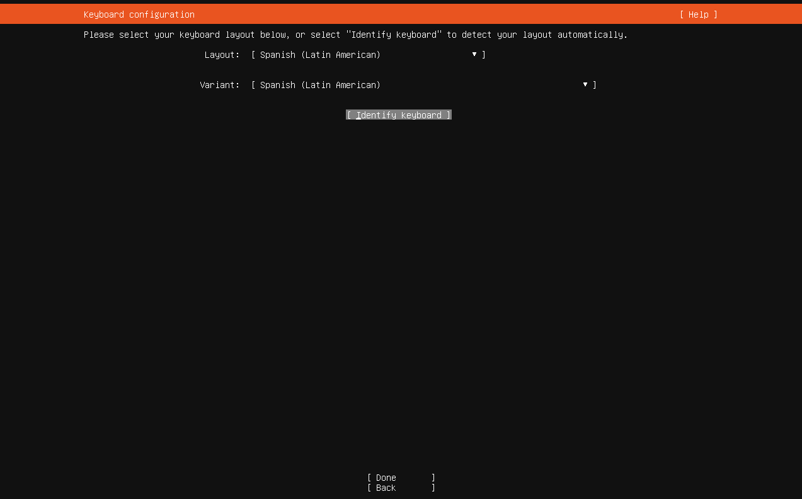
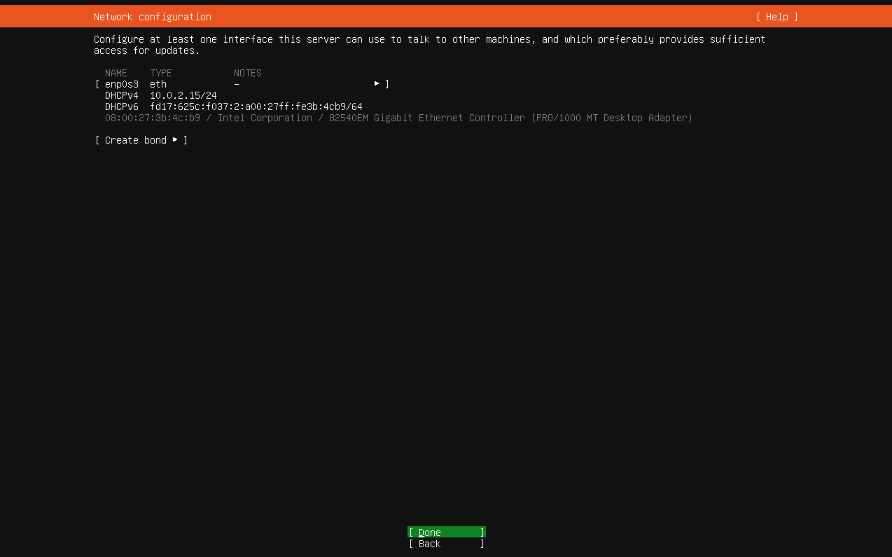
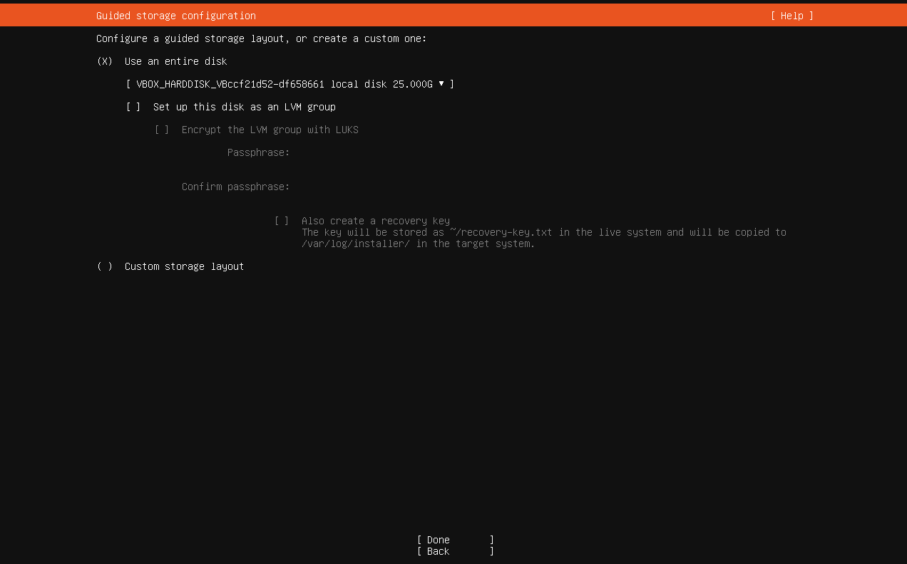
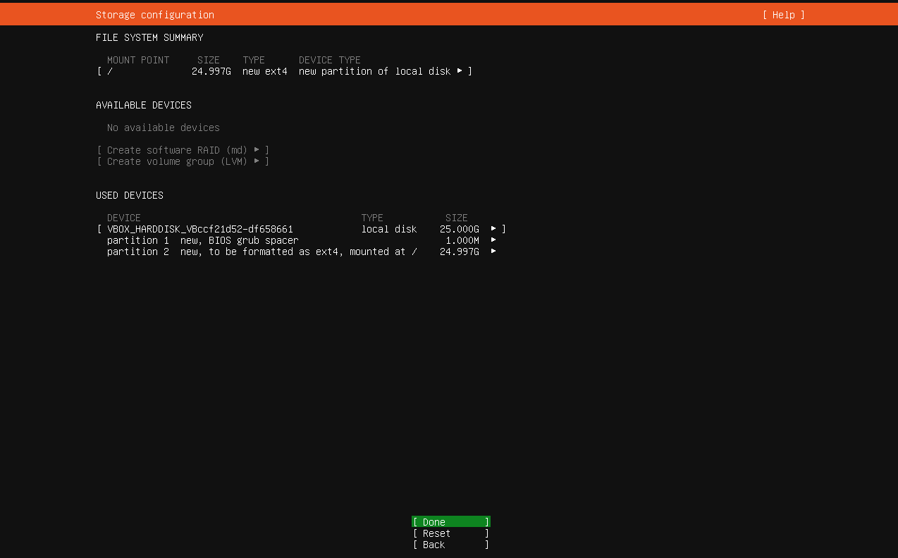
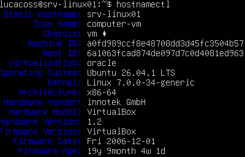

# Instalación de srv-linux01

Documentación correspondiente a la instalación del sistema operativo en `srv-linux01`.

---

## Objetivo

Instalar Ubuntu Server 26.04 LTS en una máquina virtual de VirtualBox y dejar preparado el servidor para las siguientes etapas del Homelab.

---

## Entorno

| Parámetro | Valor |
|---|---|
| Virtualizador | VirtualBox |
| VM | `srv-linux01` |
| OS | Ubuntu Server 26.04 LTS |
| Arquitectura | amd64 |
| CPU | 2 vCPU |
| RAM | 2 GB |
| Disco | 25 GB |
| Red | NAT |

---

## Procedimiento

La instalación se realizó utilizando la imagen ISO de Ubuntu Server. Y fue realizada manualmente, sin utilizar el mecanismo de instalación desatendida de VirtualBox.

## 1. Armado de la VM

Primero configuramos una nueva maquina virtual con la imagen de Ubuntu server. Enfocandonos en:

* Colocar el nombre `srv-linux01`. Pues mas adelante aumentaremos la cantidad de servidores.

* Desactivamos la opcion de instalacion desatendida. De modo que la instalacion fue completamente manual.

* Aumentamos la capacidad de nuecleos a 2 y la RAM la dejaremos como esta de base.

* Verificamos que este configurada la RED: NAT

## 2. Instalacion de Ubuntu Server

Una vez dentro de la VM. Podemos empezar la instalacion del servidor. La cual primero hara unos cuantos procesos para preparar la instalacion

## 3. Idioma

Se seleccionó **English** como idioma del instalador y del sistema.

### Motivo

Se eligió inglés para mantener el entorno alineado con la documentación técnica
de Linux y facilitar la interpretación de mensajes de error, logs y herramientas
utilizadas habitualmente en administración de sistemas. Mientras que la distribucion del teclado se selecciono:
Spanish (Latin America)





## 4. Tipo de instalación

Se seleccionó **Ubuntu Server** como tipo de instalación.

### Motivo

La máquina virtual `srv-linux01` está destinada a funcionar como servidor
Linux dentro del Homelab. Por este motivo se optó por Ubuntu Server en lugar
de una instalación minizada o con componentes third-party.

## 5. Configuración de red

El instalador detectó la interfaz de red `enp0s3`, de tipo Ethernet (`eth`).

Se configuró la interfaz mediante **DHCP**, permitiendo que la dirección IP,
gateway y otros parámetros de red sean asignados automáticamente.

La máquina virtual utiliza inicialmente una interfaz de red en modo **NAT**
proporcionado por VirtualBox.

### Decisión

Se utiliza DHCP durante la etapa inicial del Homelab para disponer de
conectividad y acceso a Internet. La configuración de red será profundizada
posteriormente, incluyendo direccionamiento estático y diferentes modos de
red de VirtualBox.



### Configuración obtenida

La interfaz `enp0s3` obtuvo automáticamente mediante DHCP la dirección
IPv4 `10.0.2.15/24`.

La interfaz también obtuvo una dirección IPv6 mediante configuración
automática.

La red IPv4 utilizada por la máquina virtual es `10.0.2.0/24`.

## 6. Configuración del proxy

No se configuró ningún proxy.

El Homelab utiliza una conexión directa a través de la interfaz de red
`enp0s3`, utilizando la conectividad NAT proporcionada por VirtualBox.

El campo de configuración del proxy se dejó vacío.


## 7. Configuracion del disco

En esta primera VM vamos a utilizar el almacenamiento guiado, pero sin **LVM ni cifrado**, manteniendo la instalación sencilla.

### Motivo

Nuestra VM tiene un disco virtual de 25 GB y está dedicada exclusivamente a srv-linux01.

No necesitamos conservar otro sistema operativo ni particiones existentes, por lo que podemos utilizar todo el disco.

LVM (Logical Volume Manager o Gestor de Volúmenes Lógicos) es un sistema de administración de almacenamiento para Linux que crea una capa flexible entre el sistema operativo y los discos físicos.
A diferencia de las particiones tradicionales (que son rígidas y de tamaño fijo), LVM permite cambiar el tamaño de los discos virtuales de forma dinámica sin necesidad de borrar datos o reiniciar el equipo.

### Opciones a seleccionar

| Opción                               | Qué hace                                                                     | Para `srv-linux01` |
| ------------------------------------ | ---------------------------------------------------------------------------- | ------------------ |
| **Use an entire disk**               | Utiliza el disco completo y crea automáticamente las particiones necesarias  | ✅ |
| **Set up this disk as an LVM group** | Utiliza LVM para administrar los volúmenes del disco                         | ❌ |
| **Encrypt the LVM group**            | Crea LVM y además cifra los volúmenes                                        | ❌ |
| **Custom storage layout**            | Permite definir manualmente particiones, LVM, filesystem, mount points, etc. | ❌ |





## 8. Perfil del servidor y usuario

Durante la instalación se creó la cuenta administrativa inicial del servidor.

### Servidor

- **Hostname:** `srv-linux01`

### Usuario

- **Usuario:** `lucacoss`
- **Home:** `/home/...`
- **Privilegios administrativos:** mediante `sudo`

La contraseña utilizada durante la instalación no se documenta ni se almacena
en el repositorio.

El usuario inicial será utilizado para las tareas administrativas del servidor
mediante `sudo`.

## 9. SSH 

En la sección SSH Setup, vamos a seleccionar:

* Install OpenSSH server

### Motivo

Nuestro objetivo es administrar srv-linux01 como un servidor, por lo que queremos poder conectarnos remotamente desde nuestra máquina host mediante `SSH`. En lugar de tener que interactuar siempre con la consola de VirtualBox.

### ¿Qué es OpenSSH?

`OpenSSH` es una implementación del protocolo SSH que permite establecer conexiones seguras y autenticadas entre equipos.

Más adelante vamos a practicar:

``` bash
ssh usuario@IP
```

Finalmente, si ubuntu da la opcion de instalar mas features mediante snaps. No seleccionamos ninguno y terminamos la instalacion. Para despues, hacer un `reboot` del sistema.

---

## Verificación

Después de finalizar la instalación se debe comprobar que el sistema operativo
haya detectado correctamente los recursos asignados a la máquina virtual y que
los principales servicios y configuraciones funcionen correctamente.

La verificación inicial se realiza mediante diferentes comandos de diagnóstico.

```bash
hostnamectl
```



Y despues ejecutar comandos para verificar que se detecte correctamente los dos CPUs y el disco:

``` bash
lscpu
```

``` bash
free -h
```

Tambien debemos verificar la red mediante los comandos:

``` bash
ip addr
```

``` bash
ip route
```

Despues probemos si nuestro usuario posee privilegios administrativos:

``` bash
sudo whoami
```

Deberia responder `root`.

Finalmente como durante la instalación seleccionamos Install OpenSSH server, ahora vamos a verificarlo.

``` bash
systemctl status ssh
```

Buscamos algo similar a:

``` text
Active: active (running)
```

