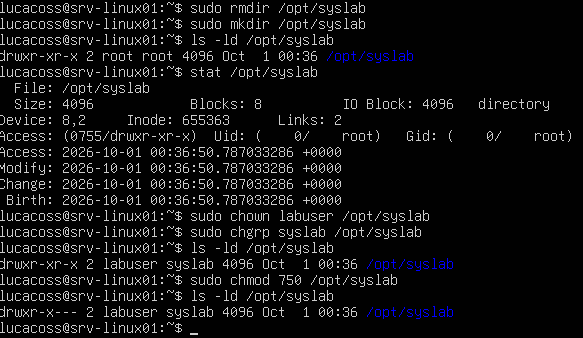

# Administración del sistema

Documentación relacionada con la administración del sistema operativo de `srv-linux01`.

---

## Objetivos

Practicar:

- Usuarios.
- Grupos.
- Permisos.
- Procesos.
- Servicios.
- systemd.
- Logs.
- Paquetes.
- Información del sistema.
- Administración básica.

---

# Administración del sistema

## 1. Actualización del sistema

Primero vamos a realizar una actualizacion de paquetes y librerias para que todo funcione correctamente. Esto lo podemos realizar con.

Actualización del sistema

``` bash
sudo apt update
```


Y despues:

``` bash
sudo apt upgrade
```


## 2. Usuarios y grupos

Antes de comenzar a crear y modificar usuarios, se identificó la cuenta utilizada actualmente en `srv-linux01`.

``` bash
whoami
```

``` bash
id
```

Con las respuestas recibidas respectivamente:

``` text
lucacoss
```

``` text
uid=1000(lucacoss) gid=1000(lucacoss) groups=1000(lucacoss),4(adm),24(cdrom),27(sudo),30(dip),46(plugdev),100(users),101(lxd)
```

el comando id es el que nos interesa especialmente porque muestra:

* `UID` → Identificador numérico del usuario.

* `GID` → Grupo principal.

Linux identifica internamente al usuario mediante este número, no solamente mediante lucacoss.

Y el GID corresponda al grupo lucacoss.

* grupos secundarios.

### 2.1 Grupos 

Tambien podemos ver los grupos a los que pertenece nuestro usuario. Mediante el comando.

``` bash
groups
```

Con sus respectivas respuestas: 


Vamos a ver los distintos grupos porque es bastante interesante analizarlos y entenderlos para despues ponernos a crear usuarios.

* `sudo`

El grupo `sudo` permite que sus miembros puedan utilizar `sudo`, sujeto a las reglas configuradas en `/etc/sudoers` y `/etc/sudoers.d/`.

``` bash
sudo whoami
```
respondió con: `root`

* `adm`

El grupo `adm` está relacionado con el acceso a determinados archivos de logs del sistema.

Esto es muy interesante porque despues vamos a estar trabajando con:

``` bash
journalctl
```

* `cdrom`

Permite acceder a dispositivos opticos cuando están configurados de esa manera. No es relevante para nuestro servidor, pero Ubuntu lo incluye en determinados perfiles de usuario.

* `dip`

Está relacionado con determinadas interfaces/configuraciones de red mediante herramientas tradicionales de Linux.

* `plugdev`

Esta relacionado con el acceso a determinados dispositivos extraibles.

* `users`

Grupo general de usuarios.

* `lxd`

### 2.2 Informacion adicional

Posteriormente, para consultar la información de la cuenta se utilizó:

``` bash
getent passwd lucacoss
```

El resultado fue:

```text
lucacoss:x:1000:1000:Lucas Cossia:/home/lucacoss:/bin/bash
```

La entrada puede interpretarse de la siguiente manera:

usuario : contraseña : UID : GID : comentario : home : shell

Este es particularmente interesante para nosotros porque Ubuntu incluye al usuario en el grupo lxd, que está relacionado con LXD, la tecnologia de gestión de contenedores/máquinas virtuales de Canonical.

Para nosotros:

| Campo             | Valor            |
| ----------------- | ---------------- |
| Usuario           | `lucacoss`       |
| UID               | `1000`           |
| GID               | `1000`           |
| Nombre/comentario | `Lucas Cossia`   |
| Home              | `/home/lucacoss` |
| Shell             | `/bin/bash`      |

### 2.3 `/etc/passwd`

El archivo `/etc/passwd` contiene información básica sobre las cuentas del sistema.

Sus permisos se verificaron mediante:

``` bash
ls -l /etc/passwd
```

Resultado:

``` text
-rw-r--r-- 1 root root 1750 Sep 30 00:28 /etc/passwd
```

El archivo pertenece al usuario `root` y al grupo `root`.

Los permisos son:

``` text
rw-r--r--
```

Por lo tanto:

`root` puede leer y modificar el archivo.
El grupo `root` puede leerlo.
**Otros usuarios** pueden leerlo.
Los **usuarios normales** no pueden modificarlo directamente.
2.4 `/etc/shadow`

La información relacionada con la autenticación se almacena en `/etc/shadow`.

Sus permisos se verificaron mediante:

``` bash
ls -l /etc/shadow
```

Resultado:

``` text
-rw-r----- 1 root shadow 846 Sep 30 00:28 /etc/shadow
```

`root` puede leer y modificar el archivo.
Los miembros del grupo `shadow` pueden leerlo.
Los demás usuarios no tienen permisos sobre el archivo.

Esta diferencia de permisos es importante porque `/etc/shadow` contiene
información sensible relacionada con la autenticación de los usuarios.

### 2.4 Directorio personal

La cuenta lucacoss tiene como directorio personal:

`/home/lucacoss`

Se verificó mediante:

``` bash
ls -ld /home/lucacoss
```

Resultado:

``` text
drwx------ 4 lucacoss lucacoss 4096 Sep 30 02:17 /home/lucacoss
```

El directorio pertenece al usuario lucacoss y al grupo `lucacoss`.

Los permisos drwx------ indican que el propietario tiene permisos sobre el
directorio, mientras que el grupo y otros usuarios no tienen permisos.

Durante la verificación también se ejecutó accidentalmente:

``` bash
ls -ld lucacoss
```

que produjo:

``` text
ls: cannot access 'lucacoss': No such file or directory
```

Esto ocurrió porque lucacoss fue interpretado como una ruta relativa desde
el directorio actual.

La ruta correcta del directorio personal es:

``` text
/home/lucacoss
```

Este caso permitió comprobar en la práctica la diferencia entre una ruta
relativa y una ruta absoluta.

### 2.5 Creacion de un usuario

Vamos a crear un usuario llamado: `labuser`.

Para eso ejecutamos el comando.

``` bash
sudo useradd -m -s /bin/bash labuser
```

El comando useradd permite crear la cuenta del usuario. En este caso utilizamos algunas opciones para configurar desde el principio el directorio personal y el shell de inicio de sesión. En particular, queremos que nuestro usuario de laboratorio tambien tenga su propio `/home` y un shell definido.

Por eso utilizamos los parametros.

* `-m` → crea el directorio /home/labuser.
* `-s /bin/bash` → establece Bash como shell de inicio de sesión.
* `labuser` → nombre de la cuenta.

Otra cosa que ocurre es que una cuenta recién creada no tiene necesariamente una clave utilizable para iniciar sesión. Por ende vamos a establecerla:

``` bash
sudo passwd labuser
```

Con esto, el sistema va a pedir dos veces la clave, para establecerla correctamente. 

### 2.6 Validacion de la creacion del usuario

Ahora vamos a proceder a validar que todo se haya creado correctamente

``` bash
id labuser
```

Y la salida es: 

``` text 
uid=1001(labuser) gid=1001(labuser) groups=1001(labuser)
```

> El UID puede variar por el sistema. Puede ocurrir que no sea 1001.

Y tambien:

``` bash
getent passwd labuser
```

Con su respectiva salida:

``` text 
labuser:x:1001:1001::/home/labuser:/bin/bash
```

Despues verificamos el directorio `/home`:

``` bash 
ls -ld /home/labuser
```

Y su salida fue:

``` text 
drwxr-x--- 2 labuser labuser 2096 Sep 30 22:46 /home/labuser
```

Y finalmente su shell asociado:

``` bash
getent passwd labuser
```

``` text 
/bin/bash
```

Por ende todo se realizo correctamente. 

### 2.7 Creacion de grupos secundarios

Creemos un grupo específico para nuestro laboratorio:

``` bash
sudo groupadd syslab
```

Y ahora agregamos `labuser` al grupo:

``` bash
sudo usermod -aG syslab labuser
```

* `-a`

    append: agrega el grupo sin eliminar los grupos secundarios existentes.

* `-G`

    Indica los grupos secundarios.

> No utilizamos solo `-G`. Pues, establece la lista de grupos secundarios indicada. Si el usuario ya perteneciera a otros grupos secundarios, podríamos reemplazar esa lista accidentalmente.

Ahora verificamos los cambios

``` bash
id labuser
```

``` bash
groups labuser
```

Con sus salidas:

``` text
uid=1001(labuser) gid=1001(labuser) groups=1001(labuser),1002(syslab)
labuser : labuser syslab
```

### 2.8 Diferencia entre usuarios

Algo que podemos mostrar es la diferencia que hay entre los usuarios `lucacoss` y `labuser`. Si nosotros entramos temporalmente a labuser con 

``` bash
su - labuser
```

Y ejecutamos:

``` bash
sudo whoami
```

``` text
sudo: I´m sorry labuser. I´m afraid I can´t do that
```

Despues salimos con `exit`.

Como `labuser` no esta en el grupo `sudo` no tiente aquellos permisos.

### 2.9 Modificacion del usuario

Aca podemos realizar modificaciones como:

``` bash
sudo usermod -c "Usuario de laboratorio" labuser
```

* El parametro `-c` modifica el campo de comentario o información descriptiva de la cuenta.

Y despues lo vereficamos

``` bash
getent passwd labuser
``` 

``` text
labuser:x:1001:1001:Usuario de laboratorio:/home/labuser:/bin/bash
```

Hay mas parametros que podemos utilizar como:

* `-s` → Establece o modifica el shell de inicio de sesión de la cuenta.

Tambien podemos modificar su clave con `sudo passwd labuser` o bloquear la cuenta con:

``` bash
sudo passwd -l labuser
```

Consultar su estado:

``` bash
sudo passwd -S labuser
```

O desbloquear su clave:

``` bash
sudo passwd -u labuser
```

De esta manera podemos deshabilitar temporalmente la autenticación mediante la clave de una cuenta sin eliminarla, lo que puede utilizarse como una forma de baja lógica.

## 3. Permisos, propietarios y grupos

En Linux, cada archivo y directorio tiene principalmente:
* un propietario;
* un grupo propietario;
* permisos para el propietario;
* permisos para el grupo;
* permisos para otros usuarios.´

Vamos a trabajar con labuser y el grupo syslab que ya creamos.

Primero vamos a crear un directorio destinado a nuestras pruebas:

``` bash
sudo mkdir /opt/syslab
```

El motivo es que `/opt` es un lugar apropiado para software o recursos adicionales del sistema. En nuestro caso lo utilizaremos simplemente como un recurso de laboratorio. Ahora verificamos cómo quedó:

``` bash
ls -ld /opt/syslab
```

``` text
drwxr-xr-x 2 root root 4096 Oct 1 00:09
```

Aca podemos hacer un analisis basico de permisos:

* Primero. Un analisis completo de la sintaxis

* `d`           → directorio
* `rwx`         → permisos del propietario
* `r-x`         → permisos del grupo
* `r-x`         → permisos de otros
* `2`           → cantidad de enlaces
* `root`        → propietario
* `root`        → grupo propietario
* `4096`        → tamaño
* `Oct 1 00:09` → fecha de modificación
* `/opt/syslab` → ruta

* Segundo. Tenemos 3 grupos de 3 tipos de permisos

    rwx - Propietario

    r-x - Grupo

    r-x - Otros

| Permiso | Significado |
|---|---|
| `r` | read — lectura |
| `w` | write — escritura |
| `x` | execute — ejecución |

### 3.1 Cambiar propietarios

El comando `chown` significa **Change owner**

``` bash
sudo chown labuser /opt/syslab
```

Y lo verificamos 

``` bash
ls -ld /opt/syslab
```

``` text
drwxr-xr-x 2 labuser root 4096 Oct 1 00:09
```

Y despues esta el comando `chgrp` que significa **Change group**

``` bash
sudo chgrp syslab /opt/syslab
```

Y lo verificamos 

``` bash
ls -ld /opt/syslab
```

``` text
drwxr-xr-x 2 labuser syslab 4096 Oct 1 00:09
```

También podríamos haber realizado ambas operaciones mediante `chown`:

``` bash
sudo chown labuser:syslab /opt/syslab
```

### 3.2 Modificacion de permisos

En esta seccion vamos a usar `chmod`

Primero vamos a explicar otras cosas de los permisos.

* `r = 4`
* `w = 2`
* `x = 1`

Por ende, tenemos que sacar cuentas como:

7 = 4 + 2 + 1 = rwx

5 = 4 + 0 + 1 = r-x

0 = 0 + 0 + 0 = ---

| Valor | Permisos |
|---:|---|
| `7` | `rwx` |
| `6` | `rw-` |
| `5` | `r-x` |
| `4` | `r--` |
| `3` | `-wx` |
| `2` | `-w-` |
| `1` | `--x` |
| `0` | `---` |

| Usuario | Permisos |
|---|---|
| `labuser` | `rwx` |
| grupo `syslab` | `r-x` |
| otros | `---` |

Entonces si realizamos una practica como:

1. Crear el directorio

2. Verificarlo

3. Ver información detallada

4. Cambiar propietario

5. Cambiar grupo

6. Verificar

7. Aplicar permisos

8. Verificamos nuevamente



### 3.3 Interaccion entre usuarios, grupos y permisos

Vamos a empezar con unos comandos

``` bash
su - labuser
whoami
    labuser
cd /opt/syslab
pwd
    /opt/syslab
touch prueba.txt
ls -l
    total 0
    -rw-rw-r-- 1 labuser labuser 0 Oct 1 00:50 prueba.txt
```

Aca detectamos una situacion interesante. Aunque el directorio `/opt/syslab` tiene como grupo propietario a `syslab`, el archivo nuevo quedó con el grupo `labuser`.

Esto ocurre porque un directorio no hereda automáticamente su grupo propietario a los archivos nuevos que se crean dentro de él.
Por defecto, el nuevo archivo utiliza el grupo principal del usuario que lo crea.

Si ejecutamos:

``` bash
umask
```

Vamos a recibir:

``` text
0002
```

La `umask` determina qué permisos se eliminan de los permisos iniciales al crear archivos y directorios. En nuestro caso, el valor `0002` contribuyó a que el archivo se creara con permisos `664` (rw-rw-r--).
El grupo propietario del archivo es un aspecto diferente y, en este caso, corresponde al grupo principal de labuser.

Y esto nos lleva a una herramienta muy interesante de Linux: `setgid`. En un directorio, setgid hace que los nuevos archivos y subdirectorios creados dentro de él hereden el grupo propietario del directorio.

Primero vamos a salir con `exit`. Despues comprobamos...

``` bash
ls -ld /opt/syslab
    drwxr-x--- 2 labuser syslab 4096 Oct 1 00:50 /opt/syslab
ls -l /opt/syslab
    total0
    -rw-rw-r-- 1 labuser labuser 0 Oct 1 00:50 preuba.txt
```

Esta situacion se puede solucionar con `setgid`.

Actualmente tenemos:
| Ubicacion | dueño:grupo |
|---|---|
| `Directorio` | `labuser:syslab` |
| `Archivo` | `labuser:labuser` |

Pero, por ejemplo, si `syslab` representa un **equipo de trabajo**. Queremos que los archivos creados dentro de `/opt/syslab` pertenezcan automáticamente al grupo: `syslab`

Para eso podemos utilizar `setgid` en el directorio.

``` bash
sudo chmod g+s /opt/syslab
```

> El g+s significa que estamos activando el bit setgid para el grupo del directorio.

Y lo comprobamos:

``` bash
ls -ld /opt/syslab
    drwxr-s--- 2 labuser syslab 4096 Oct 1 00:50 /opt/syslab
```

Antes en los permisos de grupo teniamos `r-x`. Pero ahora tenemos `r-s`. Esa `"s"` significa que `setgid` esta *activo*.

Ahora vamos a crear otro archivo:

``` bash
su - labuser
whoami
    labuser
touch /opt/syslab/prueba-setgid.txt
ls -l /opt/syslab
    total 0
    -rw-rw-r-- labuser syslab 0 Oct 1 01:17 prueba-setgit.txt
    -rw-rw-r-- labuser labuser 0 Oct 1 00:50 prueba.txt
``` 

## 4. Sistema de archivos

## 5. Procesos

## 6. Servicios y systemd

## 7. Logs y journalctl

## 8. Gestión de paquetes

## 9. Información y diagnóstico del sistema

## 10. Tareas de administración

## 11. Problemas encontrados y soluciones