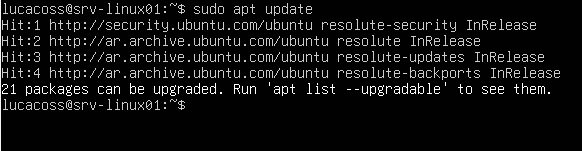
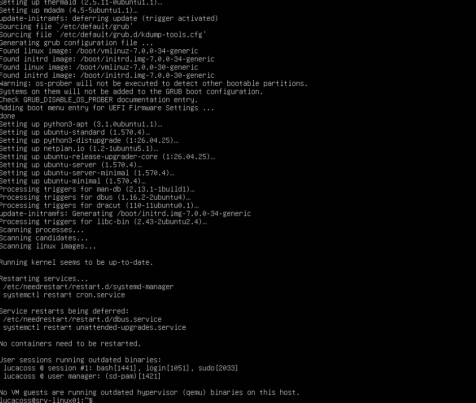
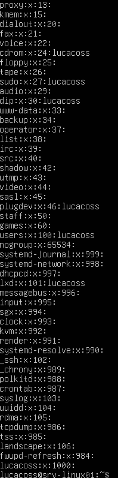

# Administración del sistema

Documentación relacionada con la administración del sistema operativo de `srv-linux01`.

---

## Objetivos

Practicar:

- Usuarios.
- Grupos.
- Permisos.
- Procesos.
- Servicios.
- systemd.
- Logs.
- Paquetes.
- Información del sistema.
- Administración básica.

---

# Administración del sistema

## 1. Actualización del sistema

Primero vamos a realizar una actualizacion de paquetes y librerias para que todo funcione correctamente. Esto lo podemos realizar con.

Actualización del sistema

``` bash
sudo apt update
```



Y despues:

``` bash
sudo apt upgrade
```



## 2. Usuarios y grupos

Ahora vamos a realizar la indentificacion del usuario actual mediante dos comandos 

``` bash
whoami
```

``` bash
id
```

Con las respuestas recibidas respectivamente:

``` text
lucacoss
```

``` text
uid=1000 gid=1000
```

el comando id es el que nos interesa especialmente porque muestra:

* `UID` → Identificador numérico del usuario.

* `GID` → Grupo principal.

* grupos secundarios.

### Grupos 

Tambien podemos ver los grupos. Mediante el comando.

``` bash
cat /etc/group
```

Con su respectiva respuesta: 



## 3. Privilegios y sudo

## 4. Sistema de archivos

## 5. Procesos

## 6. Servicios y systemd

## 7. Logs y journalctl

## 8. Gestión de paquetes

## 9. Información y diagnóstico del sistema

## 10. Tareas de administración

## 11. Problemas encontrados y soluciones